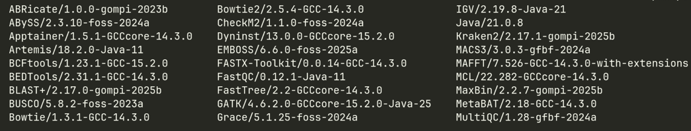
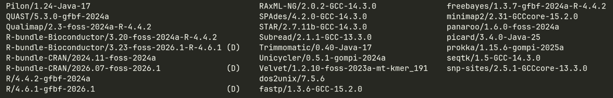

```{r include=FALSE}
knitr::opts_chunk$set(eval = FALSE)
```

<body style="background-color:gray99;">

Now that you're (hopefully) re-caffeinated and have stretched your legs and cleared your brain, let's have a look at some more need-to-know information.

# Software

::: callout-note
##Commands covered:

`module avail` - list software available

`module load [software]` - loads specific piece of software

`module unload [software]` - removed specific software

`module purge` - removes all software
:::

The linux OS has some really powerful utilities but these are not truly bioinformatics software. We have to 'install' or 'load' software. We do not want to have all our software loaded all the time, as many informatic tools are very complex i.e. requiring different versions of python or java to run. Having software that requires conflicting versions loaded at the same time can cause a malfunction.

Most managed HPC systems (not your own personal computer) manage this by using modules. These are preconfigured installers for your software packages. Cardiff systems use modules - if this is the case you can see the software that is available try the following command:

```{bash}
module avail
```

this will bring up a software list that looks something like the following:

{width="100%"}

{width="100%"}

Some time the software list can be overwelming so you can look for modeul containign letter or stating with letter by adding them to the `module avail` command - ithis search also is case insensitive - case doesn't matter. e.g. if you run this command to look for all things that contain [uni]

```{bash}
module avail uni
```

Any of these software packages can be loaded by simply using the module load command, e.g.

```{bash}
module load fastqc/v0.12.1
```

Remember to unload the module when you are finished so it does not conflict with the next piece of software, or if you want to unload all modules, use the module purge command.

```{bash}
module unload fastqc/v0.12.1
or
module purge
```

**Module versions can change so check they are correct with `module avail` rather than just copy and pasting from the guide.**

# 
