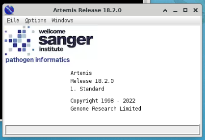
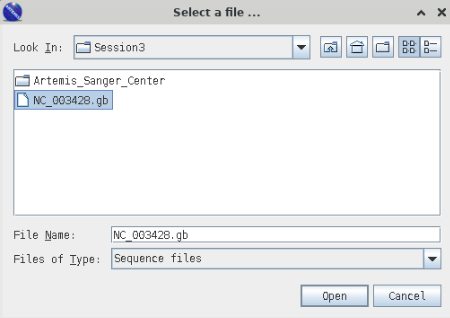
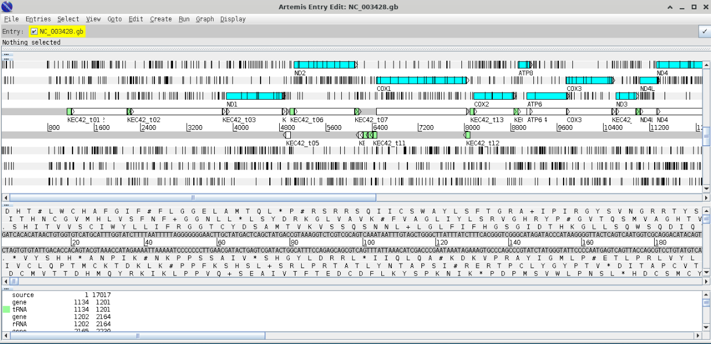
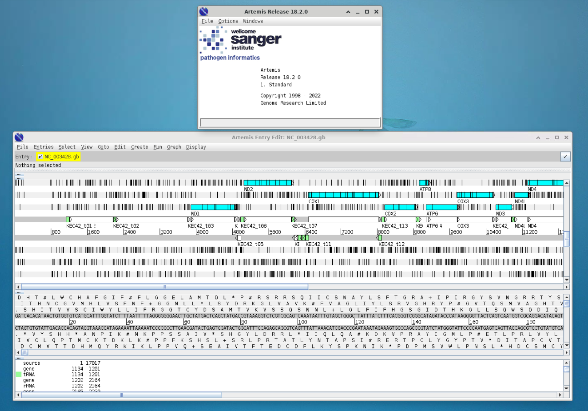
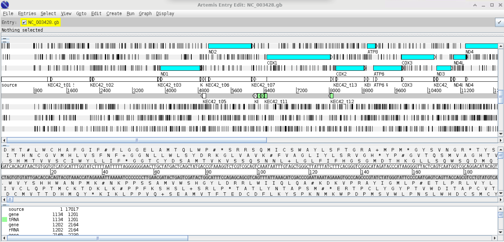

```{r include=FALSE}
knitr::opts_chunk$set(eval = FALSE)
```

<iframe data-external="1" src="https://cardiff.cloud.panopto.eu/Panopto/Pages/Embed.aspx?id=35fe879e-58e9-4141-a49a-af630098dee1&amp;autoplay=false&amp;offerviewer=true&amp;showtitle=true&amp;showbrand=true&amp;captions=false&amp;interactivity=all" height="405" width="720" style="border: 1px solid #464646;" allowfullscreen allow="autoplay">

</iframe>

::: {.callout-note collapse="true"}
## If you're feeling confident

As you go through each step of the annotation process, use loops to apply it to *all* the virus genomes you've assembled.
:::

::: {.callout-note collapse="true"}
## If you're not feeling confident

Pick one virus genome and work through annotating it. Use the time later in the extension session to use loops to apply the process to all the virus genomes.
:::

# Visualising genomes using Artemis

[Artemis](https://www.sanger.ac.uk/tool/artemis/) is a rather old but very elegant genome visualisation tool. To get you used to using it, we will try it out using an example genome that's already been annotated.

***Artemis can be installed locally [local install instructions](http://sanger-pathogens.github.io/Artemis/). Warning: this can take time, so please do not do it during teaching session.***

::: {.callout-note collapse="true"}
## Artemis Mac Install

Additional Sanger Centre training material can be downloaded using the following link - [Sanger center training](https://tinyurl.com/4dzbj9nk)

1.  download latest version of Artemis from https://github.com/sanger-pathogens/Artemis/releases/download/v18.2.0/artemis-macosx-release-18.2.0.dmg.gz

2.  download java from Latest Releases - must be jdk v11 or above, from [TechSpot](https://www.techspot.com/downloads/7407-java-se-16.html) or [Adoptium](https://adoptium.net/en-GB/temurin/releases/?version=16&os=mac&arch=x64&package=jdk)

3.  unpack Artemis - and move the files to a folder somewhere ... i.e to an Artemis directory you've made somewhere.

4.  find out what version of java is currently on your system

```{bash}
java -version
```

or you can see the java versions you have available using

```{bash}
/usr/libexec/java_home -V
```

5.  then depending on your shell - edit the relevant rc file

```{bash}
nano ~/.zshrc
```

and add a line .... change the -v1.8 to -vXX depending on the version of java you have as default.

```{bash}
export JAVA_HOME=$(/usr/libexec/java_home - v1.8)
```

6.  now install the version of java you have just downloaded - this will install and make the default java change to this version. You should also see a new line appear when you run this command.

```{bash}
/usr/libexec/java_home -V
```

7.  now run Artemis - use terminal to change to the directory you put the apps in in step 3

```{bash}
cd ~/Artemis/
Artemis.app/Contents/art
```

- will run Artemis - or alternatively you should be able to click on the icons in finder to run.

- If there is a security issue - go ... File -- System Settings -- Privacy & Security .. and then look for a statement that says "Artemis" was blocked from use because it is not from an identified developer .... and click Open Anyway - you need to have admin/sudo privileges to do this.

- Artemis should run

8.  the next time you log into your mac - the default java will be the default one and not the one required to use Artemis ... so to the terminal and type (change -v flag depending on jvm version)

```{bash}
export JAVA_HOME=$(/usr/libexec/java_home -v16)
```

- and now you should be able to run Artemis again

- if you want to keep use this java as default - edit your .zshrc file

- if you don't want to type in that command all the time, add this to your .zshrc file

```{bash}
alias javaart='export JAVA_HOME=$(/usr/libexec/java_home -v16)'
```

- and then type `javaart` into a terminal to change to the version of java required for Artemis

- alternatively you should be able to edit the

```{bash}
Artemis.app/Contents/art
#script and add
export JAVA_HOME=$(/usr/libexec/java_home - v16)
```

- at the top somewhere - haven't tested this to force the right version of java to be used.
:::

To use Artemis via your Linux desktop on the server, you need to enable it to use a visual interface. Open a new tab in MobaXterm and log in using the slightly modified command:

```{bash}
#For masters' students
ssh [your username]@sponsa.bios.cf.ac.uk -X -p [your port number]
#For Y3 students
ssh [your username]@hawker.bios.cf.ac.uk -X -p [your port number]
```

Use the three-word passphrase you were assigned.

The `-X` enables the graphical interface.

::: callout-important
## Exercise: Loading a Genome into Artemis

Load the Artemis module and initiate Artemis with command `art`

```{bash}
module load artemis/18.2.0-conda
art
```

Artemis Opening Screen

{width="40%" fig-align="center"}

Open Genbank File

```{bash}
>File >Open
```

Navigate to your Session3 folder and select the genbank file (`NC_003428.gb`).

{width="40%" fig-align="center"}

Cancel any warnings you should see the following window;

{width="40%" fig-align="center"}

The blue highlighted area should highlight open reading frames (ORFs) and the vertical lines stop codons - notice that there are vertical line in the middle of ORFs this indicates that we are using the wrong codon table. Arrange your graphics windows so you can see the Opening window which will be hidden behind the gene display window - you should see something like this.

{width="40%" fig-align="center"}

Now change the codon table by selecting

```{bash}
> Options > Genetic Code Tables
selecet
Vertebrate Mitochondrial
```

Your gene visualisation should now look like this

{width="40%" fig-align="center"}
:::

As we create our annotations, you will be able to visualise the various outputs using Artemis.

::: callout-warning
## Extension Work

I have included a range of extension exercises / guides generated by the Sanger Centre (the people who wrote Artemis) these are included in your Session3 folder under `Artemis_Sanger_Center`
:::